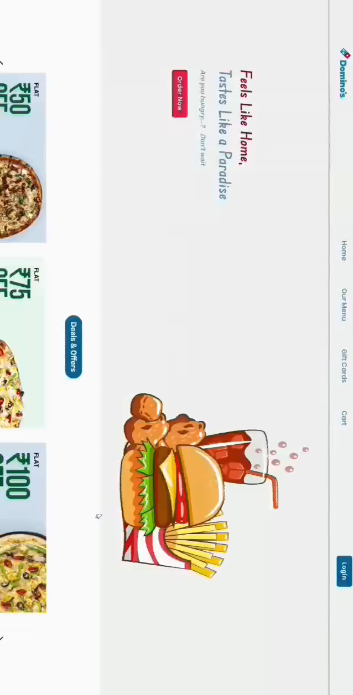
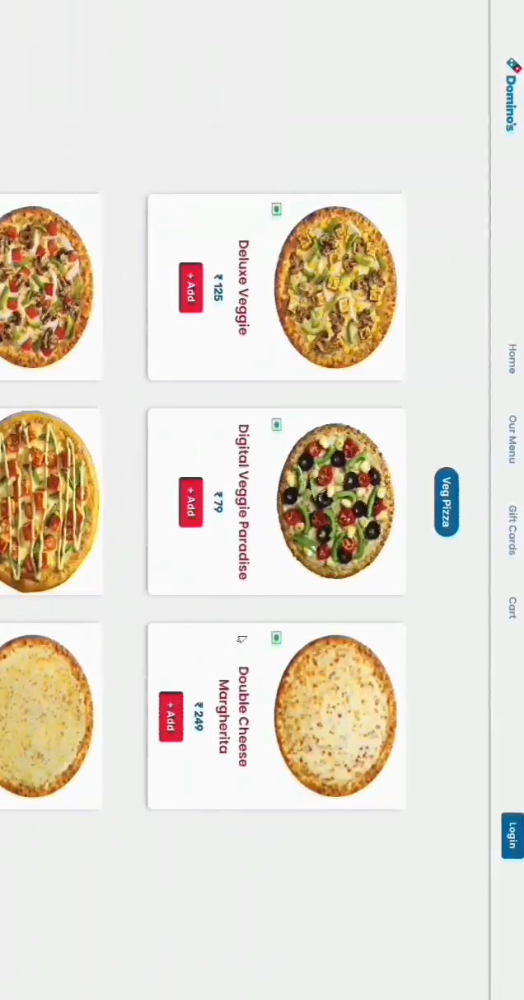
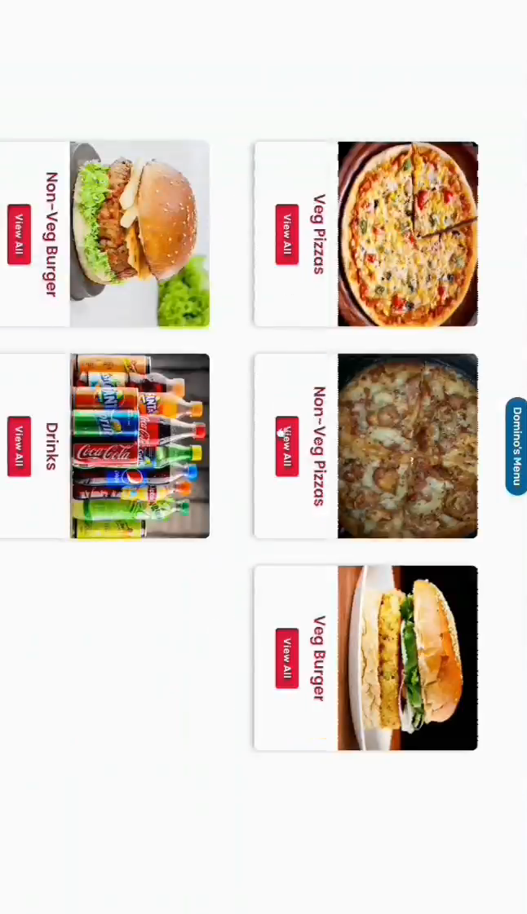
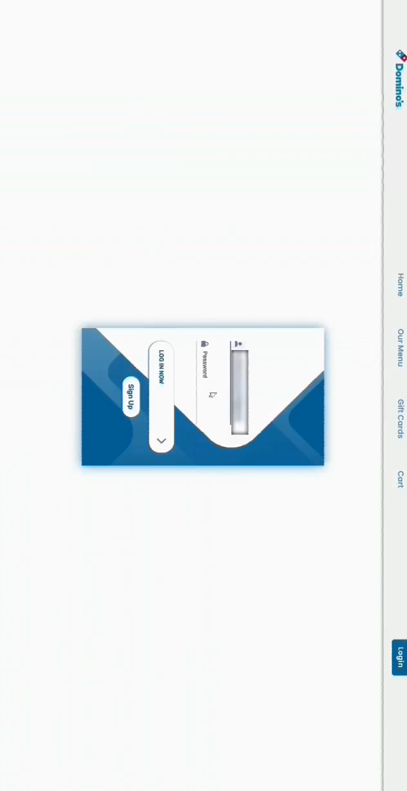
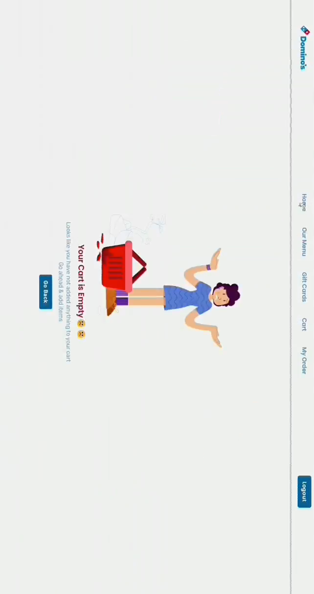
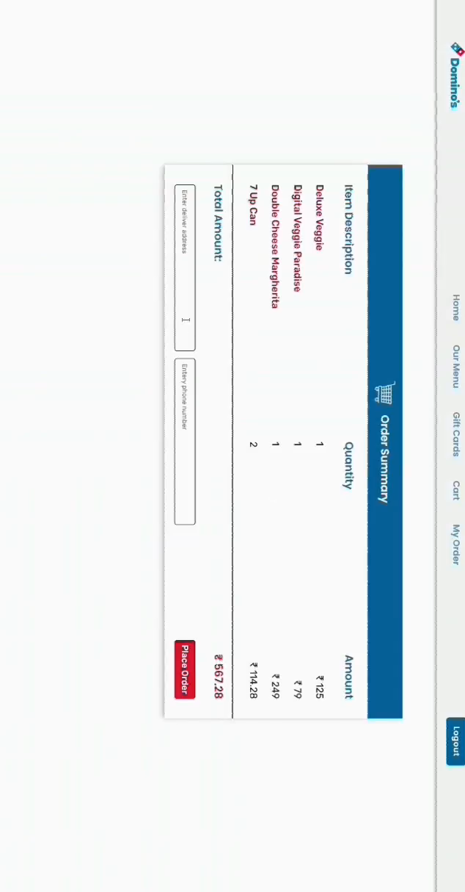
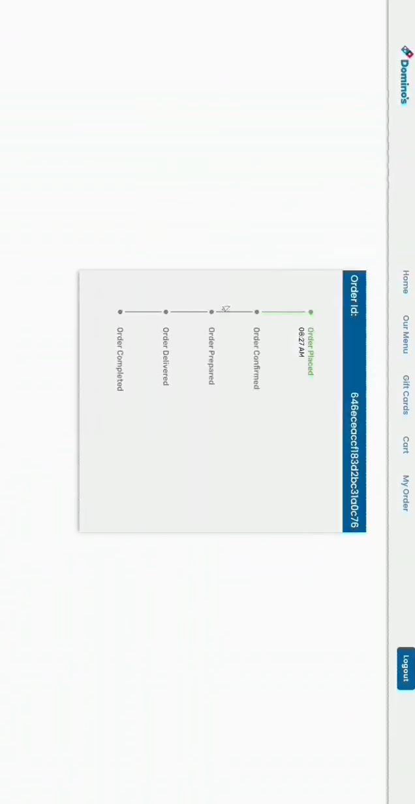
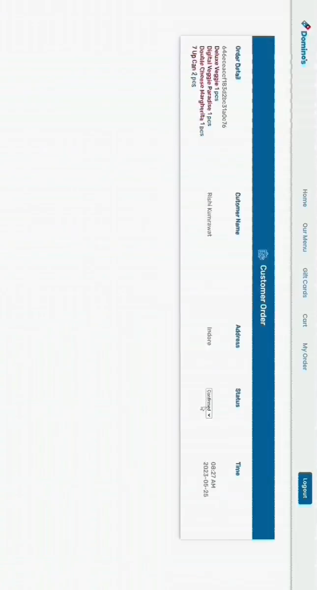

# Food Delivery App


## 👩‍💻 Description
**Food Delivery App** – a sophisticated online culinary platform meticulously designed for seamless food ordering. Elevate your dining experience with its intuitive and user-friendly interface. Explore an extensive range of menus, personalize your orders, and relish prompt doorstep delivery. Experience the pinnacle of convenience and taste.


## 🛠 Tech Stack

**Client:** HTML, CSS, JavaScript

**Server:** NodeJs, ExpressJs

**Database:** MongoDb 

**Tools**: PostMan, VS Code, Git


## ✅ Features


**Login and Register 🔐**
Securely access our platform through the user-friendly Login and Register features. Safeguard your personal information and enjoy a seamless authentication process, ensuring a secure and personalized dining experience. 🔑📬

**Home Page 🏠**
Experience a captivating welcome interface on our home page. Discover an array of enticing UI coupons and exclusive offers designed to elevate your dining journey. 🎉

**Menu Section 📜**
Effortlessly navigate through a diverse and thoughtfully curated menu. Seamlessly categorized by culinary themes, our menu section ensures an intuitive and delightful browsing experience. 🍔🍣🍕

**Cart Page 🛒**
Craft your perfect meal with ease using our user-friendly cart page. Tailor your selections, manage quantities, and seamlessly proceed to checkout, all within a streamlined and efficient interface. 🛍️

**Order Page 📝**
Place your orders confidently through our intuitive order page. With detailed customization options and real-time order summaries, your preferences are at the forefront of every transaction. ✅

**Order Tracking 🚚🌍**
Stay informed with our state-of-the-art order tracking feature. Follow your culinary delights from kitchen to doorstep, receiving timely updates and ensuring a seamless and satisfying delivery experience. 🕐


## 🚀 Project Installation Guide 

Before you begin, ensure that you have **Node.js** and **MongoDB** installed on your local machine.

 **Clone the Project:**
   Start by cloning this repository to your local machine using your preferred method.

 **Open in Code Editor:**
   Navigate to the project folder and open it in your preferred code editor. We recommend **Visual Studio Code** for a smooth experience.

 **Configure MongoDB Connection:**
   In the project's `server.js` file, locate the database connection section. Add your MongoDB database string to establish a connection.

   ```javascript

   mongoose.connect(YOUR_DATABASE_STRING, { useNewUrlParser: true });
```

Open terminal and move to the project directory and run the below command

```bash
  npm install
  npm start
```

- Project will be live on localhost:3000

## 🖼️ Screenshots

<p align="">
  
  
  
    
  
  
   
  
</p>


    
